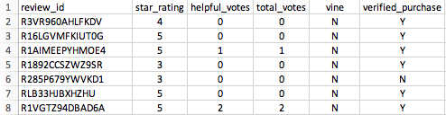
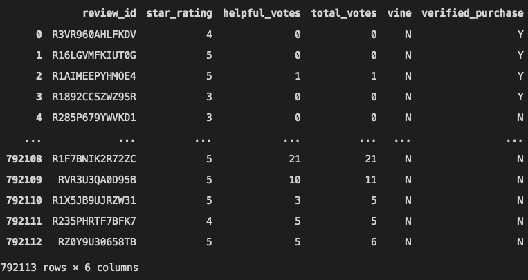
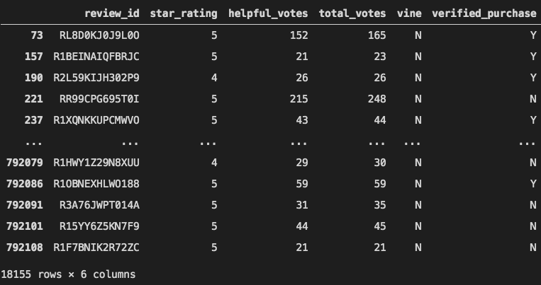
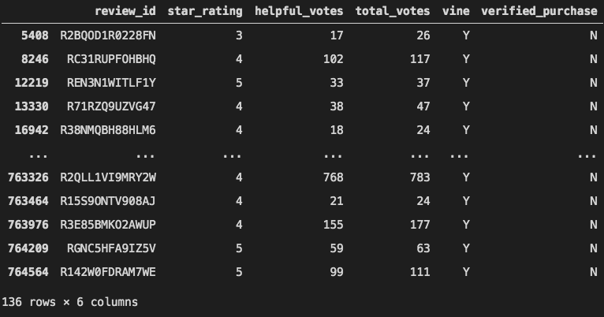
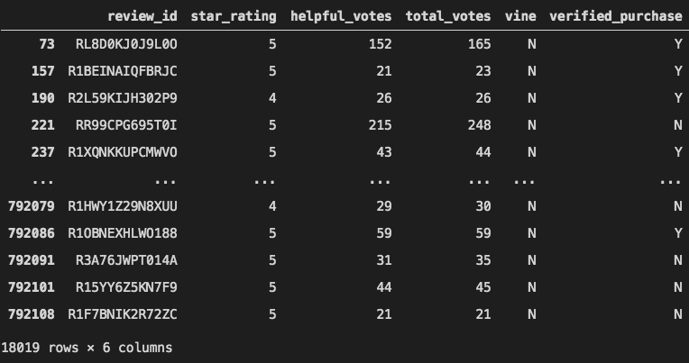
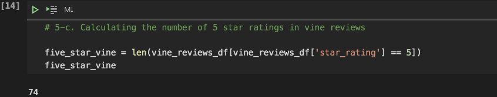
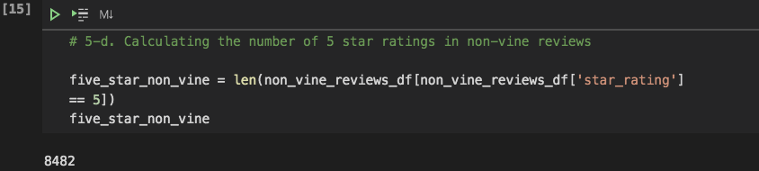
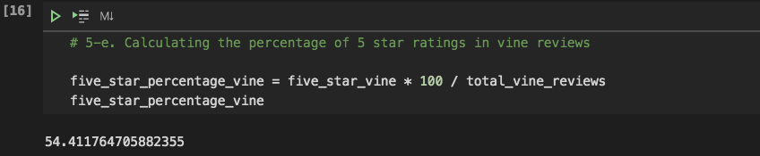
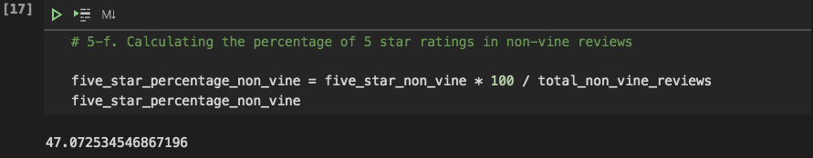
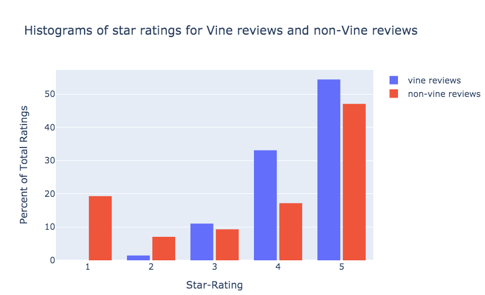

# **Amazon_Vine_Analysis**  


## **Overview of Project**
In this project we are performing analysis on the data obtained from Amazon Vine program to determine wether or not there is a bias in favor of Vine (paid) reviews


### **Purpose**

Our data source is a table created from a larger data source we extracted from Amazon. the main data source can be found on: [Original Data](https://s3.amazonaws.com/amazon-reviews-pds/tsv/amazon_reviews_us_Furniture_v1_00.tsv.gz
), and it entails information on the reviews for the furniture products. [Fig. 1](screen_shots/vine_table.png) shows a view of the table we created from this data source to perform our analysis:


<center>

|*Fig. 1*|
:--:
||
</center>
&nbsp;

In this dataset, we have information about the reviews and whether it is a Vine review or not. Using the provided dataset we are trying to determine if there is a bias against the non-Vine (unpaid) reviews.
&nbsp;

## **Results**  

For this project we used Jupyter notebook, and Pandas package. In this section we will review the steps of this analysis:
&nbsp;

- First we read the data which is in a CSV file and load it into a Panda's dataframe ([Fig. 2](screen_shots/vine_df.png)). There are 792,113 rows of data (reviews) in this data frame

  <center>

  |*Fig. 2*|
  :--:
  ||
  </center>
  &nbsp;

- In the next step we filtered the data to keep only the reviews that have 20 or more total votes ([Fig. 3](screen_shots/high_votes_df.png)), the result is a dataframe that contains 18,739 reviews.

  <center>

  |*Fig. 3: Reviews with 20 or more total votes*|
  :--:
  ||
  </center>
  &nbsp;

- Again we filtered the remaining data for those that have the helpful votes to total votes ratio of 0.5 or higher ([Fig. 4](screen_shots/helpful_votes_df.png)). As you can see in the figure, at this point we have 18,155 reviews to work with.

  <center>

  |*Fig. 4: Reviews with (helpful votes/total votes) >= 0.5*|
  :--:
  ||
  </center>
  &nbsp;

- The remaining data was divided into two data frames one for Vine reviews ([Fig. 5](screen_shots/vine_reviews_df.png)) and another that contains non-Vine reviews ([Fig. 6](screen_shots/non_vine_reviews_df.png)).

  <center>

  |*Fig. 5: Vine reviews*|
  :--:
  ||

  |*Fig. 6: non-Vine reviews*|
  :--:
  ||
  </center>
  &nbsp;

  We can see that the total number of Vine and non-Vine reviews are respectively 136 and 18,019. We also can confirm these numbers using the following two lines of code  
  ```py
  total_vine_reviews = len(vine_reviews_df)
  total_non_vine_reviews = len(non_vine_reviews_df) 
  ```
  &nbsp;

- Using the codes in [Fig. 7](screen_shots/5s_vine.png) and [Fig. 8](screen_shots/5s_non_vine.png) the number of five stars reviews for both Vine and non-Vine reviews were determined:

  <center>

  |*Fig. 7: Number of 5 stars reviews for Vine reviews*|
  :--:
  ||

  |*Fig. 8: Number of 5 stars reviews for non-Vine reviews*|
  :--:
  ||
  </center>
  &nbsp;

  There are 74 five star reviews for Vine reviews and 8,482 five star reviews for non-Vine reviews. 
  &nbsp;

- Having the total number of reviews and the number of five star reviews for both Vine and non-Vine groups we can calculate the percentage of 5 stars reviews in each of these groups:

  <center>

  |*Fig. 9: Percentage of 5 stars reviews for Vine reviews*|
  :--:
  ||

  |*Fig. 10: Percentage of 5 stars reviews for non-Vine reviews*|
  :--:
  ||
  </center>
  &nbsp;

  [Fig. 9](screen_shots/5s_perc-vine.png) and [Fig. 10](screen_shots/5s_perc-non_vine.png) illustrate that 54 percent of Vine reviews and 47 percent of non-Vine reviews are 5 stars.
  &nbsp;


## **summary**  

- According to the percentage of the 5 stars reviews, we can say that there is no significant difference between 47% and 54%, this result shows that around 50% of the reviews in both groups have 5 stars ratings. So we may say, there is no bias in the favor of Vine (paid) reviews. But we still can't be without doubt, because we are not sure if the rest of the data supports this statement. 
- One analysis we can do in addition to what we have done up to this point is to plot the histograms of the star ratings for each group (Vine and non-Vine) and compare them to see the difference in the distribution. [Fig. 11](screen_shots/hist.png) shows this comparison.

    <center>

    |*Fig. 11: Histograms of star ratings for Vine and non-Vine reviews*|
    :--:
    ||
    </center>
    &nbsp;

  Now, considering how all ratings (from one star to five stars) are distributed in each group we can say that there might be evidence indicating some degree of bias toward the Vine reviews. There is not even a single 1 star review in Vine reviews, only a small percentage of the reviews are 2 stars in that group, and 33 percent of the reviews are 4 stars in Vine reviews while non-Vine group has 17 percent four stars reviews.